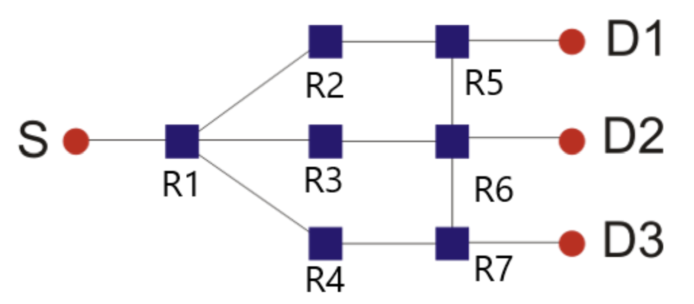
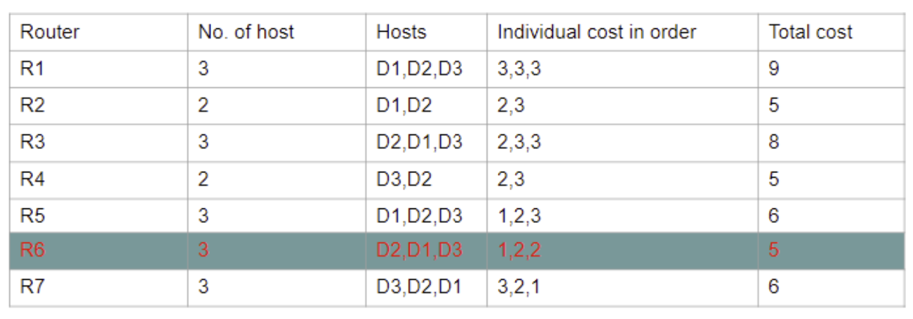
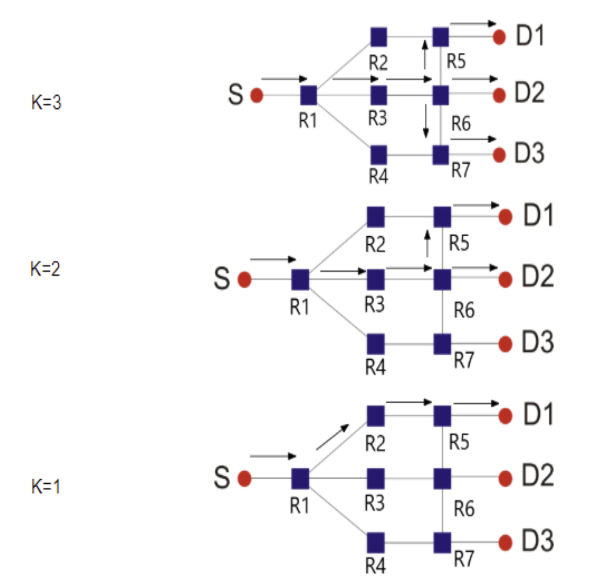
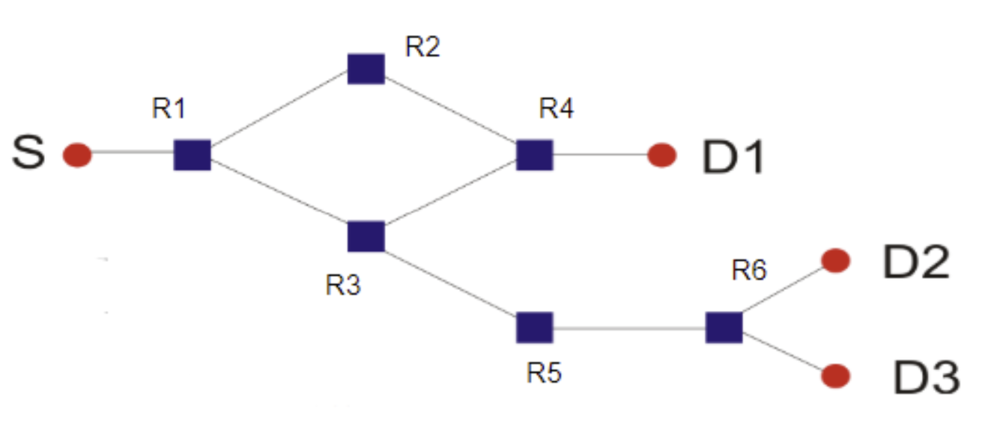
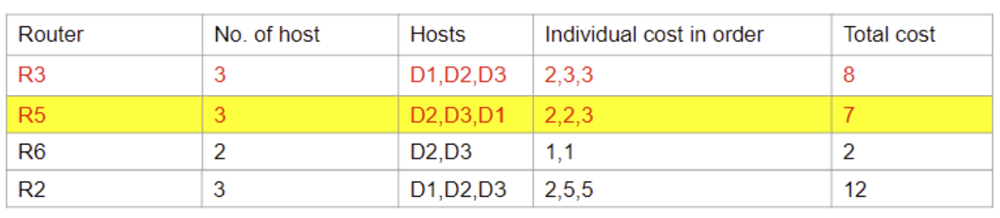
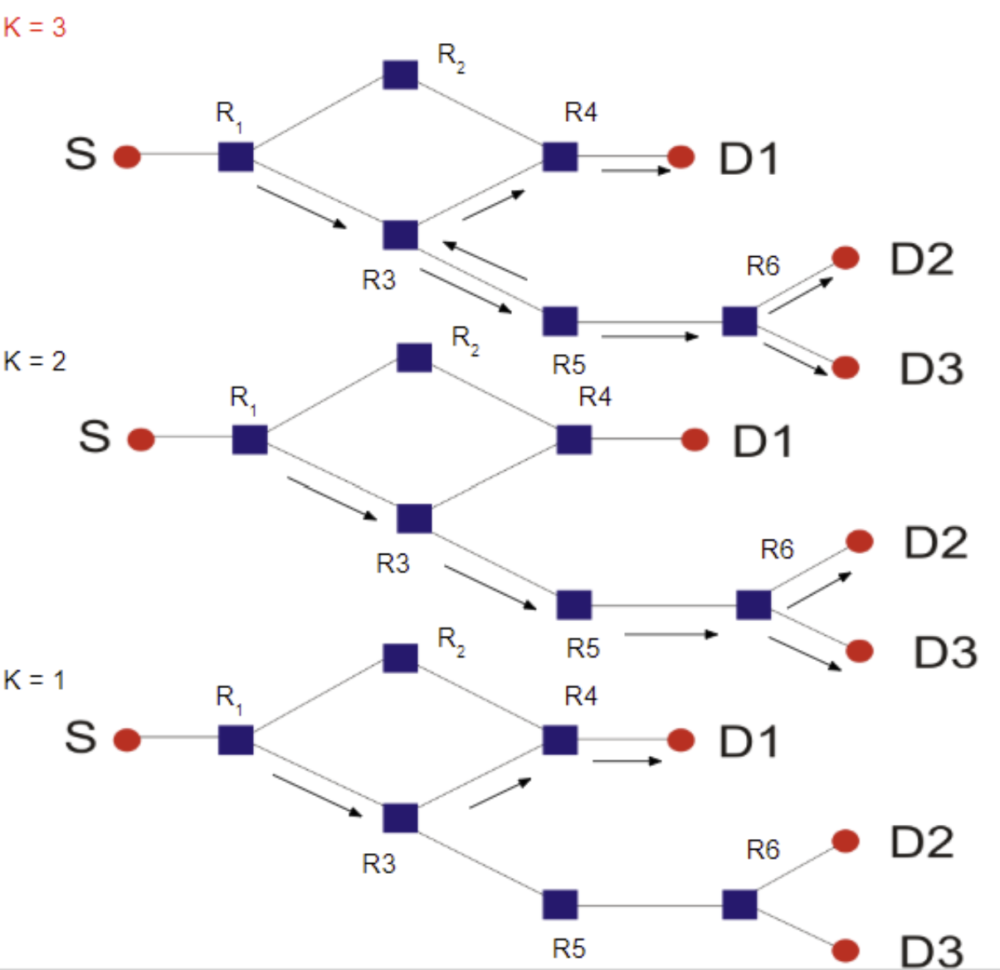

# K_Out_of_N_Multicast.
> This project aims to design a “k-out-of-n” multicast system which can be used to optimize seleective multicasting. Such system can be used to quick alerts in case of emergency to few of available locations. The locations are selected to in such a way that time and cost of multicasting are minimum. 

## Table of contents
* [General info](#general-info)
* [Technologies](#technologies)
* [Algorithm](#algorithm)
* [Setup](#Setup)
* [Demo](#demo)
* [Reference](#reference)

## General info
* Project is implemented and tested on several netwrok topologies.
* The implementation allows to select best destination nodes and the largest common path for the destinations from the source.
* Link-State Protocol and Dijkstra's are used for routing algorithm.
* Implmentation is based on centralisation of routing table and maintaining a seperate routing table for multicasting.
* Assumptions
  * Each end node is attached to only one router.
  * All links have same characteristics: hop cost 1 and same MTU 1500 bytes.
  * Small maximum number of nodes (50).
  * IDs 100-150 are destination nodes, IDs 151-199 are source nodes and IDs 200-254 are routers.
  * Packets are going to be delivered to k out of n destinations (Max N = 3) for demo.
  * All routing tables are stored at a centralized location.
  * Hosts have pre-configured IPs/IDs.

## Technologies
* Virtual tool to create network topologies - Mininet
* Scripting Language -  Python3.

## Algorithm
* Routing Algorithm:
  * LS protocol based on Dijkstra’s shortest path algorithm is used as baseline routing protocol to create a routing table for each router in the network.
  * Routing tables will provide us info about number of hosts connected to a router and their cost.
  * Routing tables are created for each router and are maintained at a centralized location.
  * Using the information present in all routing tables we will create a supplementary Router-to-Host mapping table to be used for multicasting.  
* Multicast Algorithm:
  * Algorithm based on rendezvous point scheme. 
  * Using the details such as the respective cost to each destination from all the routing tables, a supplementary table is created.
    * Supplementary table will have entries for routers that have multiple hosts connected to them.
    * Only those hosts are included for which cost is less than or equal to threshold value(Th).
    * Variable threshold (Th) will equal the value of N (i.e. for this project it is 3).
  * Out of these routers in supplementary table “best router” is found for given value of K based on the total cost for each host for respective routers.
* Algorithms for Message Forwarding (Best Rendezvous Point):
  * The router with the number of hosts more than or equal to K is selected.
  * If many routers are eligible the router with least total cost is selected.
  * If K is less than the number of hosts, hosts with the same next hop, same cost, or with least cost are selected.
  * Source sends packet to selected router and at that router sends packet to destinations.
  * At the selected router for the destinations with the same next hop there will be a unified packet but for the destinations with different next hop the packet splits up.
* Below is flow chat of “k-out-of-n” multicast

## Setup
* Install Mininet virtual networking image in virtual box.
* Install python3 in Mininet image.
* Copy python scripts :: **HostDictionary.py, Routing.py, Source.py, Router.py, Host.py and topology script**.
* Execute Routing.py with argument createRoutingTable to create Routing Tables and Multicast Table.These will be writtern in HostDictionary.py 
* Execute topology python script to create topology(Network_1/topo1.py or Network_2/network_topo_2.py).
* Verify the topology using ping commands from host to destinations.
* Execute Host.py on Host nodes as Host.py <nodeid>
* Execute Router.py on Router nodes as Router.py <nodeid>.  
* Execute Source.py on source node as Source.py <nodeid>.

## Demo
* Demonstrartion for Network 1.

 * Mulicast table using routing and multicast algorithm on Network 1.

 * Results for different values of k.

* Demonstrartion for Network 2.

 * Mulicast table using routing and multicast algorithm on Network 2.

 * Results for different values of k.

## Reference
* [Predicting CoVID-19 community mortality risk using machine learning and development of an online prognostic tool, 2020 by Das et al](https://www.ncbi.nlm.nih.gov/pmc/articles/PMC7528809/pdf/peerj-08-10083.pdf)
